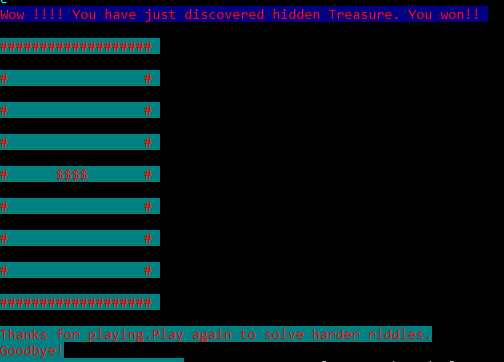

# Welcome to The Amer Fort (A Land Of Mysterious Treasure)
This is command line based RPG game.
This game is based on one of most popular fort located in western part of India.Fort was ruled by various famous kingdoms and one of kingdoms stored mysterious treasure during his rule.There are many rooms in this fort. 
There are riddle-loving-monsters surrounding a treasure in a fort.
You have to answer monster riddle.
If you answer correctly you will get gems.It will give you hints if you pay gems by typing '#pay'.You can type '#giveup' to fight the monster.
You have to reach hidden treasure by killing or outsmarting the monsters.
If Found, Could Make You Really, Really Rich! ... Maybe you're the one destined to solve the mystery, and bask in its glory.

## how to build
mvn package

## how to run
java -jar target/hidden-treasure-0.0.1-SNAPSHOT.jar

## PS
This game is not easy, but you can actually discover mysterious treasure, if you try hard enough!

this is a proof!

